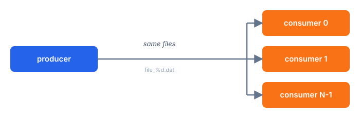
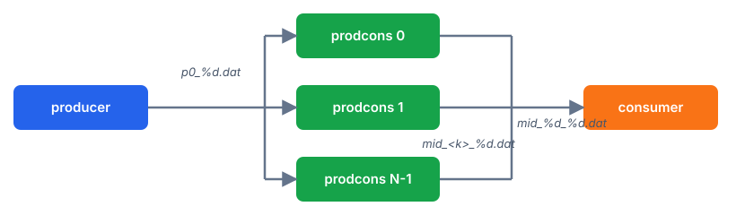

# IO File Access Patterns

A collection of C++ programs that exercise different file-I/O access patterns. They are driven as a pipeline by the `launch.sh` and `launch_capio.sh` scripts.

## Build

```sh
cmake -S . -B build
cmake --build build
```

## The binaries

Three executables are built under `build/`:

- **`producer`** — writes files. Supports two write patterns: `streaming` and `backward-seeks`.
- **`consumer`** — reads files. With `--modules N` it reads a two-index file format `(module,file)`.
- **`prodcons`** — reads files and writes output files. Takes `--window`, `--count`, `--size`, `--input`, `--output`, `--pattern`.

## Producer write patterns

Streaming is the default and writes each file sequentially without backward seeks:

```sh
./build/producer --pattern streaming --size 1048576 --window 4096
```

Backward seeks write the same number of bytes by seeking from the file end toward offset zero before every write:

```sh
./build/producer --pattern backward-seeks --size 1048576 --window 4096
```

## Launch scripts

`launch.sh` runs native binaries with CLIP interception. `launch_capio.sh` runs them on CAPIO. Both are driven by the same environment variables and both support the same topologies. The active topology defaults to `chain`.

### Environment contract

| Variable | Default | Description |
|----------|---------|-------------|
| `TOPOLOGY` | `chain` | Data-flow shape: `chain`, `pipeline`, `broadcast`, or `fanin`. |
| `N` | `2` | Fan-out count for `broadcast` and `fanin`. |
| `EXTRA_PRELOAD` | *(empty)* | Colon-separated libraries prepended to each binary's `LD_PRELOAD`. |
| `PATTERN` | `streaming` | Write pattern: `streaming` or `backward-seeks`. |
| `WINDOW_SIZE` | `1024` | I/O window size in bytes. |
| `FILE_SIZE` | `1073741824` | Size of each file in bytes. |
| `FILE_COUNT` | `1` | Number of files produced and consumed. |
| `OUTPUT_FILE_FORMAT` | `file_%d.dat` | printf-style file-name template for the shared stream (`chain`, `broadcast`). |

Topologies that pin stream names ignore `OUTPUT_FILE_FORMAT`:
`pipeline` and `fanin` use `p0_%d.dat` / `p1_%d.dat`, and `fanin` uses `mid_%d_%d.dat`.

## Topologies

### chain

`producer` writes, one `consumer` reads the same files (`OUTPUT_FILE_FORMAT`).


```sh
./launch.sh
```

```sh
./launch_capio.sh
```

### pipeline

`producer `→ `prodcons` → one `consumer`. Files go `p0_%d.dat` → `p1_%d.dat`.


```sh
TOPOLOGY=pipeline ./launch.sh
```

```sh
TOPOLOGY=pipeline ./launch_capio.sh
```

### broadcast

`producer` writes once; `N` parallel `consumer` processes all read the same files.



```sh
TOPOLOGY=broadcast N=4 ./launch.sh
```

```sh
TOPOLOGY=broadcast N=4 ./launch_capio.sh
```

### fanin

`producer` → `p0_%d.dat`. `N` parallel `prodcons` each read `p0_%d.dat` and write `mid_<k>_%d.dat`. A final `consumer` reads the union via `--modules N` with the format `mid_%d_%d.dat`.



```sh
TOPOLOGY=fanin N=4 ./launch.sh
```

```sh
TOPOLOGY=fanin N=4 ./launch_capio.sh
```

## Injecting libraries

Set `EXTRA_PRELOAD` to prepend libraries to each binary's `LD_PRELOAD`, before the script's own interceptor. Use colons to separate more than one library.

```sh
EXTRA_PRELOAD=/path/libfoo.so ./launch.sh
```

```sh
EXTRA_PRELOAD=a.so:b.so ./launch.sh
```